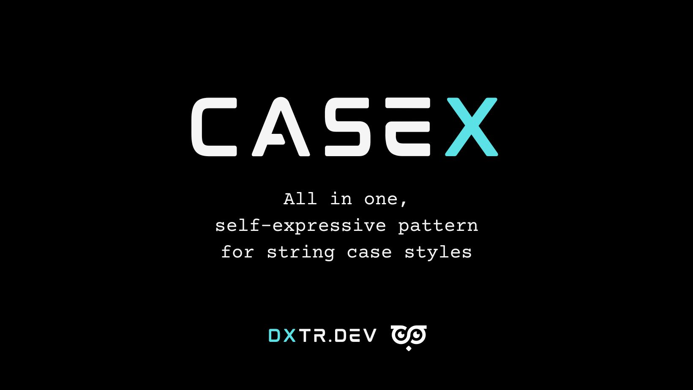

  

  All in one, self expressive function for string case styles

  
  
  
  

## Brought to you by [DXTR.DEV](https://dxtr.dev)

DXTR was founded to create tools and apps that improve developer experience and productivity.

If you like this project, consider checking out our other apps and tools at [https://dxtr.dev](https://dxtr.dev).

## About Casex

Casex is a function that applies a case style given a pattern. Instead of having a specific function for each case style, we provide a self-expressive pattern that represent the desired output.

Here is how some of the most popular string styles can be represented with Casex:

- lowercase: `case`
- UPPERCASE: `CASE`
- snake_case: `ca_se`
- kebab-case: `ca-se`
- camelCase: `caSe`
- UpperCamelCase: `CaSe`
- Sentence case: `Ca se`
- Title Case: `Ca Se`

We also provide support for keeping the style of parts of the string (`*`) or removing characters (`-`.

- Capitalize first letter: `C* **`
- First letter of each word (initials): `C-S-`

## Documentation

The ful documentation is available at [dxtr.dev/casex](dxtr.dev/casex)

## Previous versions

Casex 4.x is not compatible previous versions. If you need previous docs please refer to:

- [v0.x](https://github.com/dxtr-dot-dev/casex/tree/0.x)
- [v1.x](https://github.com/dxtr-dot-dev/casex/tree/1.x)
- [v2.x](https://github.com/dxtr-dot-dev/casex/tree/2.x)
- [v3.x](https://github.com/dxtr-dot-dev/casex/tree/3.x)

## License

Casex is open-sourced software licensed under the [./LICENSE.md](MIT license).
